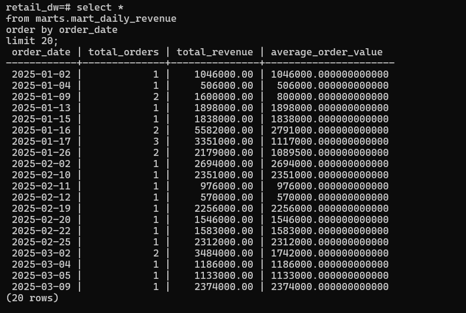
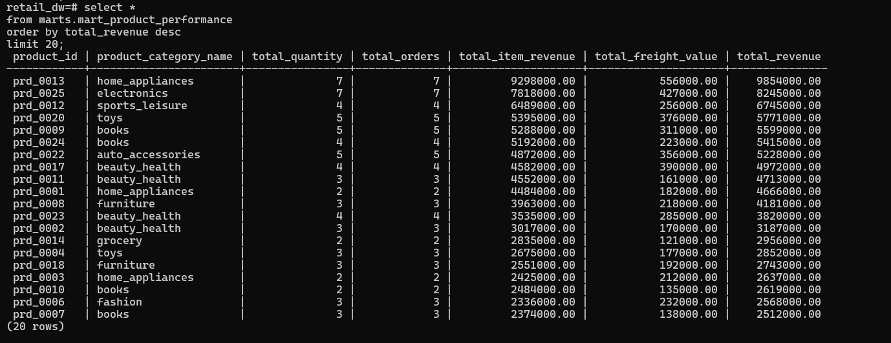
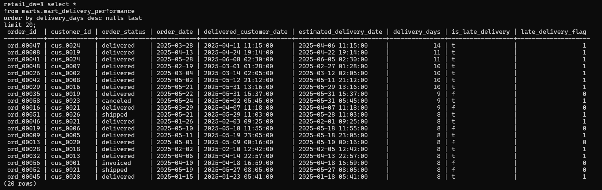
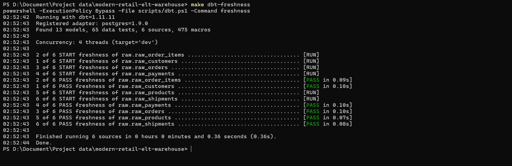
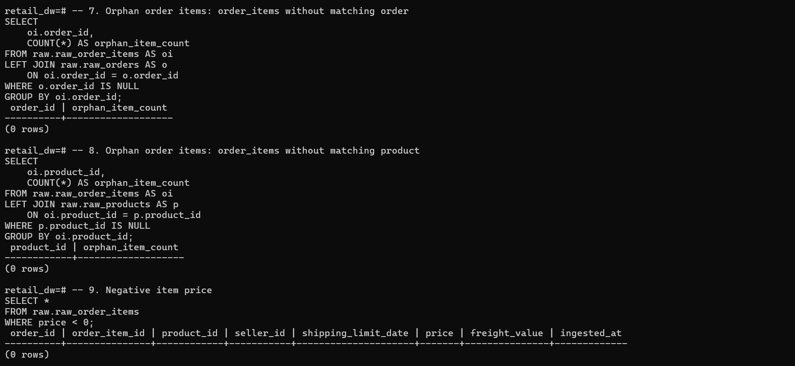

# Modern Retail ELT Warehouse

## 1. Giới thiệu

Modern Retail ELT Warehouse là project portfolio Data Engineering mô phỏng một ELT data warehouse cho dữ liệu bán lẻ dạng CSV.
Project tập trung vào ingestion bằng Python, lưu dữ liệu raw trong PostgreSQL và transform bằng dbt Core.
Các bảng analytics-ready phục vụ phân tích doanh thu, sản phẩm và giao hàng.

Mục tiêu chính là thể hiện tư duy xây dựng pipeline có validation, metadata tracking, data quality checks và mô hình dữ liệu rõ ràng.
Nội dung được viết theo hướng phù hợp cho vị trí Data Engineer Intern/Fresher.

## 2. Bài toán

Dữ liệu bán lẻ ở dạng CSV thô gây khó khăn cho phân tích doanh thu, hiệu suất sản phẩm và giao hàng.
Project xây dựng ELT warehouse để biến dữ liệu thô thành các bảng analytics-ready có kiểm soát chất lượng dữ liệu.

Warehouse này giúp chuẩn hóa dữ liệu, tách rõ raw/staging/marts layer, kiểm tra lỗi phổ biến và chuẩn bị nền tảng cho dashboard hoặc orchestration trong tương lai.

## 3. Kiến trúc tổng quan

```text
CSV Files
-> Python Ingestion
-> PostgreSQL Raw Layer
-> dbt Staging
-> dbt Core Marts
-> dbt Analytics Marts
-> Data Quality Checks
-> Dashboard-ready Tables
```

- `CSV Files`: dữ liệu nguồn nằm trong `data/raw/`.
- `Python Ingestion`: đọc CSV bằng pandas, validate schema/primary key, normalize tên cột và load vào PostgreSQL.
- `PostgreSQL Raw Layer`: lưu dữ liệu gần với nguồn trong schema `raw`.
- `metadata.ingestion_runs`: ghi nhận mỗi lần chạy ingestion, gồm trạng thái, số dòng, thời gian và lỗi nếu có.
- `dbt Staging`: chuẩn hóa kiểu dữ liệu, timestamp, text field và khóa kỹ thuật.
- `dbt Core Marts`: tạo dimension table và fact table.
- `dbt Analytics Marts`: tạo bảng phân tích doanh thu, sản phẩm và giao hàng.
- `Data Quality Checks`: gồm Python validation, dbt tests/source freshness và SQL checks.

## 4. Tech Stack

| Layer/Component | Tool | Vai trò trong project |
| --- | --- | --- |
| Ingestion | Python, pandas, SQLAlchemy | Đọc CSV, validate dữ liệu và load vào PostgreSQL |
| Database | PostgreSQL, Docker Compose | Chạy local database, lưu raw layer và metadata |
| Transformation | dbt Core, dbt-postgres | Xây dựng staging models, core marts và analytics marts |
| Data Quality | Python validation, dbt tests, SQL checks, pytest | Kiểm tra dữ liệu ở nhiều lớp |
| Local Environment | Docker Compose, Makefile | Khởi động database và chạy các command lặp lại |
| Documentation | Markdown, screenshots | Ghi lại kiến trúc, data model, data quality và kết quả chạy |

## 5. Tính năng đã hoàn thành

**Ingestion**

- Config-driven ingestion bằng `ingestion/table_config.py`.
- Load nhiều CSV: customers, orders, order_items, products, payments, shipments.
- Validate file tồn tại, required columns và primary key/composite key không null.
- Normalize tên cột về dạng lowercase/trim.
- Xử lý duplicate theo primary key bằng cách giữ bản ghi cuối cùng trước khi load.
- Idempotent loading bằng `TRUNCATE + INSERT`.
- Structured logging và ghi metadata vào `metadata.ingestion_runs`.

**Database/raw layer**

- Docker Compose PostgreSQL local.
- Schema `raw` cho raw tables.
- Schema `metadata` cho ingestion run tracking.
- Raw tables có primary key hoặc composite primary key theo `db/init.sql`.

**dbt modeling**

- Source definitions cho raw tables trong `dbt/models/sources.yml`.
- Staging models: `stg_customers`, `stg_orders`, `stg_order_items`, `stg_products`, `stg_payments`, `stg_shipments`.
- Core marts: `dim_customers`, `dim_products`, `fact_orders`, `fact_order_items`.
- Analytics marts: `mart_daily_revenue`, `mart_product_performance`, `mart_delivery_performance`.

**Data quality**

- Python validation trước khi load.
- dbt tests: `not_null`, `unique`, `relationships`, `accepted_values`.
- dbt source freshness dựa trên `ingested_at`.
- SQL checks cho null, duplicate, orphan records, negative values và logic giao hàng/doanh thu.

**Testing**

- pytest cho ingestion validators và table config.
- Makefile có command chạy pytest và dbt commands.

**Documentation**

- README và tài liệu chi tiết trong `docs/`.
- Screenshots kết quả ingestion, dbt run/test, source freshness, marts và SQL checks trong `screenshots/`.

## 6. Cấu trúc thư mục

```text
modern-retail-elt-warehouse/
|-- data/
|   |-- raw/
|   |-- sample/
|-- db/
|   |-- init.sql
|-- dbt/
|   |-- dbt_project.yml
|   |-- profiles.yml
|   |-- macros/
|   |-- models/
|       |-- sources.yml
|       |-- staging/
|       |-- marts/
|           |-- core/
|           |-- analytics/
|-- docs/
|   |-- architecture.md
|   |-- data_model.md
|   |-- data_quality.md
|   |-- project_story.md
|   |-- tradeoffs.md
|-- ingestion/
|   |-- config.py
|   |-- db.py
|   |-- load_csv_to_postgres.py
|   |-- logger.py
|   |-- table_config.py
|   |-- validators.py
|-- screenshots/
|-- scripts/
|   |-- dbt.ps1
|-- sql_practice/
|-- tests/
|-- docker-compose.yml
|-- Makefile
|-- requirements.txt
|-- README.md
```

## 7. Cách chạy local

### 1. Clone repo

```bash
git clone <repo-url>
cd modern-retail-elt-warehouse
```

### 2. Tạo `.env` từ `.env.example`

```bash
cp .env.example .env
```

Trên Windows PowerShell:

```powershell
Copy-Item .env.example .env
```

### 3. Khởi động PostgreSQL bằng Docker

```bash
make up
```

### 4. Cài dependencies

```bash
make install
```

### 5. Chạy ingestion

```bash
make load
```

### 6. Chạy pytest

```bash
make test
```

### 7. Chạy dbt

```bash
make dbt-debug
make dbt-run
make dbt-test
make dbt-freshness
```

Có thể chạy riêng staging hoặc marts:

```bash
make dbt-run-staging
make dbt-test-staging
make dbt-run-marts
make dbt-test-marts
```

### 8. Chạy SQL quality checks

```bash
make run-sql FILE=sql_practice/05_data_quality_checks.sql
```

## 8. Data Model

**Raw tables**

- `raw.raw_customers`
- `raw.raw_orders`
- `raw.raw_order_items`
- `raw.raw_products`
- `raw.raw_payments`
- `raw.raw_shipments`

**Staging models**

- `stg_customers`
- `stg_orders`
- `stg_order_items`
- `stg_products`
- `stg_payments`
- `stg_shipments`

**Core marts**

- Dimension tables: `dim_customers`, `dim_products`
- Fact tables: `fact_orders`, `fact_order_items`

**Analytics marts**

- `mart_daily_revenue`
- `mart_product_performance`
- `mart_delivery_performance`

Chi tiết grain, business logic và assumptions được mô tả trong [docs/data_model.md](docs/data_model.md).

## 9. Data Quality Strategy

Project áp dụng data quality ở 3 lớp:

- **Python validation trước khi load**: kiểm tra file tồn tại, required columns, primary key/composite key không null, normalize column names và duplicate handling.
- **dbt tests sau transformation**: kiểm tra `not_null`, `unique`, `relationships`, `accepted_values` và source freshness.
- **SQL quality checks**: phát hiện null keys, duplicate records, orphan records, negative values và logic lỗi như delivery date trước purchase date.

Chi tiết nằm trong [docs/data_quality.md](docs/data_quality.md).

## 10. Kết quả analytics

Các marts chính:

- `mart_daily_revenue`: doanh thu, số đơn hàng và average order value theo ngày.
- `mart_product_performance`: số lượng bán, số đơn hàng, doanh thu sản phẩm và category.
- `mart_delivery_performance`: delivery days, late delivery flag và trạng thái giao hàng.

Screenshots:

- 
- 
- 
- 
- 

## 11. Điều đã học được

- Thiết kế ELT pipeline từ CSV đến warehouse layer.
- Quản lý raw, staging và marts layer bằng PostgreSQL và dbt.
- Viết ingestion pipeline có validation, logging và idempotency.
- Tracking pipeline runs bằng `metadata.ingestion_runs`.
- Modeling fact table và dimension table ở mức cơ bản.
- Dùng dbt tests, source freshness và SQL checks để kiểm soát data quality.
- Viết tài liệu kỹ thuật rõ ràng để giải thích project trong phỏng vấn.

## 12. Future Improvements

- Airflow orchestration cho scheduling, retry và dependency management.
- GitHub Actions CI/CD để chạy pytest, dbt compile/test tự động.
- Dashboard BI hoàn chỉnh bằng Power BI hoặc Metabase.
- Incremental model cho các bảng/marts lớn hơn.
- SCD Type 2 cho dimension cần theo dõi lịch sử thay đổi.
- AWS-ready architecture với S3, RDS/Redshift/Athena và secrets management.
- Thêm `dim_dates`, `dim_sellers` và customer retention mart nếu mở rộng dataset.

## 13. Tài liệu chi tiết

- [Architecture](docs/architecture.md)
- [Data Model](docs/data_model.md)
- [Data Quality](docs/data_quality.md)
- [Trade-offs](docs/tradeoffs.md)
- [Project Story](docs/project_story.md)

## 14. Tác giả

Project được xây dựng bởi Bùi Đức Đại nhằm rèn luyện kỹ năng Data Engineering thực tế và chuẩn bị ứng tuyển Data Engineer Intern/Fresher.
