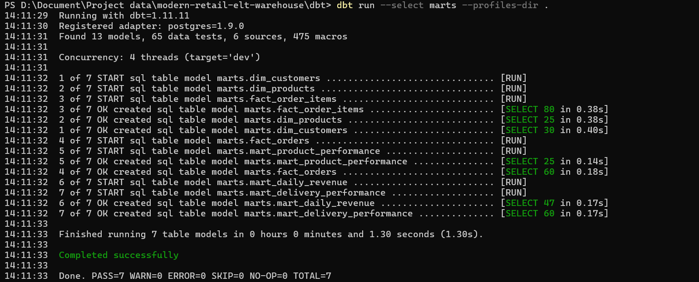
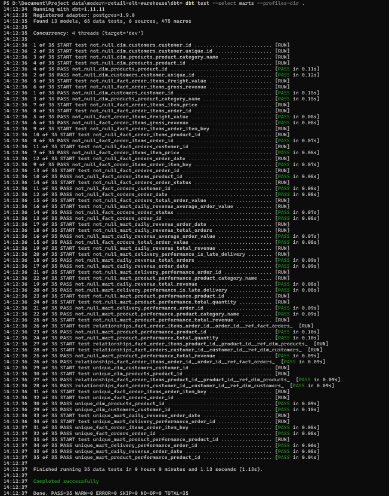
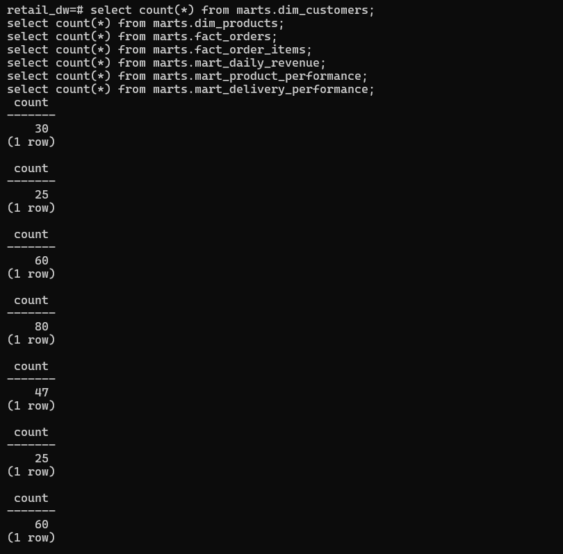
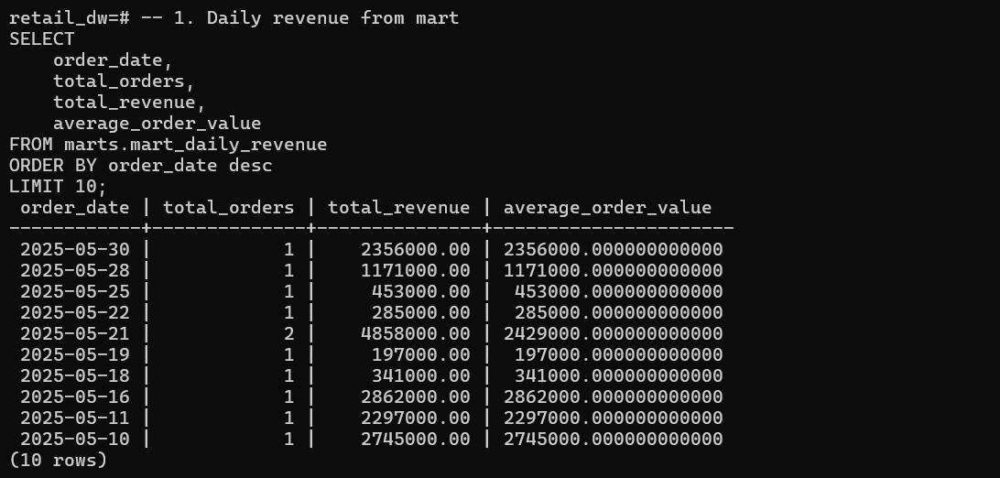
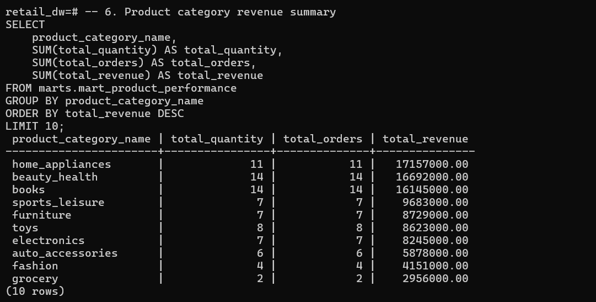
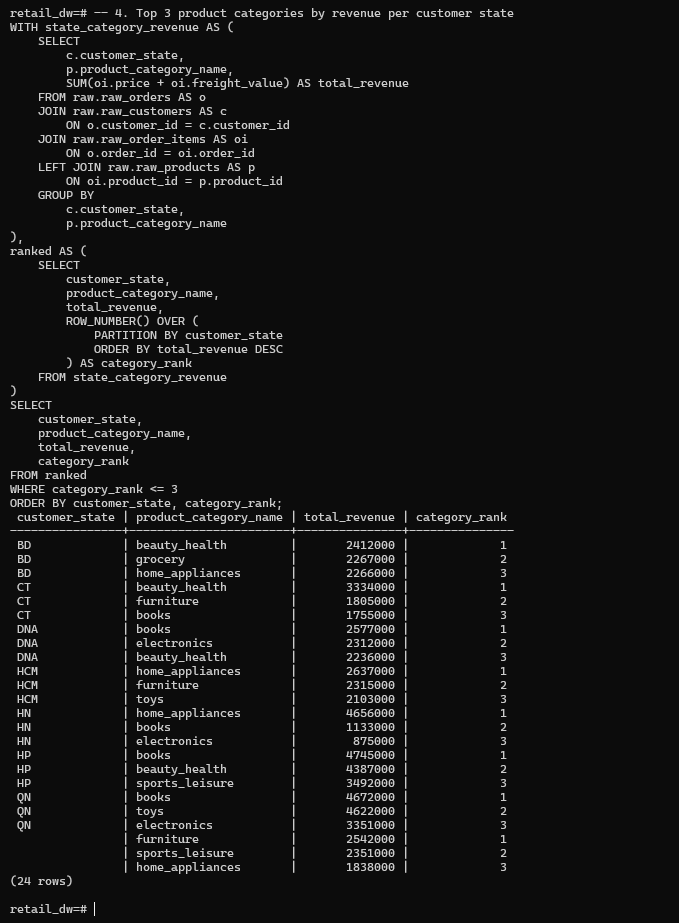

# Modern Retail ELT Warehouse

Production-style retail ELT warehouse built with **Python, PostgreSQL, Docker Compose, and dbt Core**.

This project focuses on building a reliable batch ELT pipeline for retail analytics, including raw data ingestion, validation, idempotent loading, ingestion tracking, dbt staging models, dbt marts, dbt tests, source freshness checks, SQL data quality checks, and analytics-ready tables for revenue, product, and delivery reporting.

---

## 1. Business Problem

Retail teams need reliable analytics for revenue, customer behavior, product performance, and delivery operations. However, raw operational data is often inconsistent, duplicated, missing required fields, or difficult to query directly for business reporting.

This project builds a modern ELT warehouse that:

- ingests raw retail CSV data into PostgreSQL;
- validates required columns and primary keys before loading;
- tracks every ingestion run with row counts, status, timestamps, and error messages;
- transforms raw data into clean dbt staging models;
- builds analytics-ready marts for revenue, product, and delivery analysis;
- applies dbt tests and SQL checks to improve data reliability;
- prepares the warehouse foundation for future dashboarding, orchestration, CI/CD, and cloud deployment.

---

## 2. Project Highlights

- Built a batch ELT warehouse for CSV-based retail data.
- Implemented a config-driven Python ingestion pipeline.
- Added required column validation, primary key validation, composite key validation, and column normalization.
- Used an idempotent reload strategy with `TRUNCATE + INSERT` for raw tables.
- Tracked ingestion history in `metadata.ingestion_runs`.
- Built dbt staging models, core dimension/fact tables, and analytics marts.
- Added dbt tests, source freshness checks, and SQL data quality checks.
- Documented architecture, data model, data quality strategy, trade-offs, screenshots, and project story.

---

## 3. Current Project Status

### Completed

- Python ingestion pipeline
- PostgreSQL raw schema
- Config-driven multi-table loading
- Required column validation
- Primary key null validation
- Composite primary key validation
- Column name normalization
- Idempotent reload strategy using `TRUNCATE + INSERT`
- Ingestion run tracking
- Structured logging
- Basic pytest coverage
- Dockerized local PostgreSQL environment
- dbt project setup
- dbt raw sources
- dbt staging models
- dbt staging tests
- dbt source freshness check
- Basic dbt marts
- Core dimension and fact tables
- Analytics marts for revenue, product performance, and delivery performance
- SQL data quality checks
- SQL interview practice queries
- README screenshots
- Project story documentation

### Planned / Future Improvements

- Metabase dashboard
- More custom dbt business tests
- Airflow orchestration
- GitHub Actions CI/CD
- AWS-ready architecture notes
- SCD Type 2 snapshot
- Incremental models
- Intermediate dbt layer for more complex business logic

---

## 4. Tech Stack

| Category | Tools |
| --- | --- |
| Language | Python 3.11 |
| Database | PostgreSQL |
| Data Processing | pandas |
| DB Access | SQLAlchemy, psycopg2 |
| Transformation | dbt Core, dbt-postgres |
| Testing | pytest, dbt tests |
| Containerization | Docker Compose |
| BI | Metabase, planned |
| Orchestration | Airflow, planned |
| CI/CD | GitHub Actions, planned |

---

## 5. Architecture

```text
CSV Retail Dataset
        ↓
Python ingestion pipeline
        ↓
Validation and column normalization
        ↓
PostgreSQL raw layer
        ↓
Ingestion metadata tracking
        ↓
dbt staging layer
        ↓
dbt marts layer
        ↓
Analytics-ready tables
        ↓
Metabase dashboard, planned
```

Current scope:

```text
raw → staging → marts
```

Planned future scope:

```text
raw → staging → intermediate → marts → dashboard/orchestration/CI
```

---

## 6. Project Structure

```text
modern-retail-elt-warehouse/
│
├── ingestion/
│   ├── load_csv_to_postgres.py
│   ├── validators.py
│   ├── config.py
│   ├── db.py
│   ├── logger.py
│   └── table_config.py
│
├── tests/
│   ├── test_validators.py
│   ├── test_config.py
│   └── test_load_csv.py
│
├── dbt/
│   ├── dbt_project.yml
│   ├── profiles.yml
│   └── models/
│       ├── staging/
│       │   ├── sources.yml
│       │   ├── schema.yml
│       │   ├── stg_customers.sql
│       │   ├── stg_orders.sql
│       │   ├── stg_order_items.sql
│       │   ├── stg_products.sql
│       │   ├── stg_payments.sql
│       │   └── stg_shipments.sql
│       │
│       └── marts/
│           ├── core/
│           │   ├── dim_customers.sql
│           │   ├── dim_products.sql
│           │   ├── fact_orders.sql
│           │   ├── fact_order_items.sql
│           │   └── schema.yml
│           │
│           └── analytics/
│               ├── mart_daily_revenue.sql
│               ├── mart_product_performance.sql
│               ├── mart_delivery_performance.sql
│               └── schema.yml
│
├── sql_practice/
├── screenshots/
├── docs/
│   ├── architecture.md
│   ├── data_model.md
│   ├── data_quality.md
│   ├── project_story.md
│   └── tradeoffs.md
│
├── scripts/
│   └── dbt.ps1
│
├── docker-compose.yml
├── Makefile
├── requirements.txt
└── README.md
```

---

## 7. Data Ingestion Design

The ingestion layer loads raw retail CSV files into PostgreSQL raw tables.

### Current Features

- Config-driven ingestion using `TABLE_CONFIG`
- Multi-table loading support
- Input file existence validation
- Required column validation
- Primary key null validation
- Composite primary key validation for tables such as order items and payments
- Column name normalization
- Idempotent reload strategy using `TRUNCATE + INSERT`
- Ingestion metadata tracking
- Structured logging
- Basic unit testing with pytest

### Ingestion Flow

```text
validate input file exists
        ↓
read CSV with pandas
        ↓
validate required columns
        ↓
normalize column names
        ↓
validate primary keys
        ↓
truncate target table
        ↓
batch insert into PostgreSQL
        ↓
record ingestion run metadata
        ↓
log success or failure
```

---

## 8. Raw Tables

Current raw tables:

```text
raw.raw_customers
raw.raw_orders
raw.raw_order_items
raw.raw_products
raw.raw_payments
raw.raw_shipments
```

Metadata table:

```text
metadata.ingestion_runs
```

### Example Ingestion Metadata Query

```sql
SELECT *
FROM metadata.ingestion_runs
ORDER BY started_at DESC;
```

Tracked fields include:

- `run_id`
- `source_name`
- `target_table`
- `row_count`
- `status`
- `started_at`
- `finished_at`
- `error_message`

---

## 9. dbt Modeling Layers

This project uses dbt to transform raw retail data into clean staging models and analytics-ready marts.

### Staging Layer

Staging models clean and standardize raw data.

Current staging models:

```text
stg_customers
stg_orders
stg_order_items
stg_products
stg_payments
stg_shipments
```

Typical staging transformations:

- select useful columns;
- rename columns consistently;
- cast dates and timestamps;
- cast numeric values;
- normalize text fields;
- prepare data for downstream marts.

### Marts Layer

The marts layer contains business-ready dimension, fact, and analytics tables.

Core models:

```text
dim_customers
dim_products
fact_orders
fact_order_items
```

Analytics models:

```text
mart_daily_revenue
mart_product_performance
mart_delivery_performance
```

### Planned Intermediate Layer

An intermediate layer is planned for future improvements when the project adds more complex business logic, such as customer retention, advanced delivery analysis, and more reusable metric definitions.

---

## 10. Data Model

### Core Tables

| Model | Type | Grain | Purpose |
| --- | --- | --- | --- |
| `dim_customers` | Dimension | One row per `customer_id` | Customer attributes |
| `dim_products` | Dimension | One row per `product_id` | Product attributes |
| `fact_orders` | Fact | One row per `order_id` | Order-level metrics |
| `fact_order_items` | Fact | One row per order item | Item-level revenue metrics |

### Analytics Marts

| Model | Grain | Key Metrics |
| --- | --- | --- |
| `mart_daily_revenue` | One row per `order_date` | `total_orders`, `total_revenue`, `average_order_value` |
| `mart_product_performance` | One row per `product_id` | `total_quantity`, `total_orders`, `total_revenue` |
| `mart_delivery_performance` | One row per `order_id` | `delivery_days`, `is_late_delivery` |

---

## 11. Data Quality

Current data quality checks include Python-level validation, dbt tests, source freshness, and SQL data quality checks.

### Python Ingestion Validation

- required columns exist;
- primary keys are not null;
- composite primary keys are valid;
- input files exist before loading;
- ingestion status is tracked in metadata table.

### dbt Tests

Current dbt tests include:

- `not_null` tests;
- `unique` tests;
- `relationships` tests;
- `accepted_values` tests for selected fields.

Example command:

```bash
make dbt-test
```

### dbt Source Freshness

The project includes a source freshness check to help detect stale raw data.

Example command:

```bash
make dbt-freshness
```

### SQL Data Quality Checks

SQL checks are included for common data quality issues such as:

- null keys;
- duplicate keys;
- orphan records;
- invalid payment/revenue logic;
- mart sanity checks.

---

## 12. How to Run Locally

### 1. Start PostgreSQL

```bash
make up
```

### 2. Install dependencies

```bash
make install
```

### 3. Run ingestion pipeline

```bash
make load
```

### 4. Run Python tests

```bash
make test
```

### 5. Run dbt debug

```bash
make dbt-debug
```

### 6. Run dbt staging models

```bash
make dbt-run-staging
make dbt-test-staging
```

### 7. Run dbt marts

```bash
make dbt-run-marts
make dbt-test-marts
```

### 8. Run dbt source freshness

```bash
make dbt-freshness
```

### 9. Run all dbt models and tests

```bash
make dbt-run
make dbt-test
```

---

## 13. Validate Loaded Data

### Raw Table Counts

```sql
SELECT COUNT(*) FROM raw.raw_customers;
SELECT COUNT(*) FROM raw.raw_orders;
SELECT COUNT(*) FROM raw.raw_order_items;
SELECT COUNT(*) FROM raw.raw_products;
SELECT COUNT(*) FROM raw.raw_payments;
SELECT COUNT(*) FROM raw.raw_shipments;
```

### Ingestion Runs

```sql
SELECT *
FROM metadata.ingestion_runs
ORDER BY started_at DESC;
```

### Analytics Mart Checks

Depending on the dbt target schema, replace `marts` with your actual dbt schema if needed.

```sql
SELECT *
FROM marts.mart_daily_revenue
ORDER BY order_date
LIMIT 20;

SELECT *
FROM marts.mart_product_performance
ORDER BY total_revenue DESC
LIMIT 20;

SELECT *
FROM marts.mart_delivery_performance
ORDER BY delivery_days DESC NULLS LAST
LIMIT 20;
```

---

## 14. Analytics Outputs

### Daily Revenue Mart

`mart_daily_revenue` helps answer:

- How many orders were placed each day?
- What was the daily revenue?
- What was the average order value?

### Product Performance Mart

`mart_product_performance` helps answer:

- Which products generated the most revenue?
- Which product categories performed best?
- How many order items were sold per product?

### Delivery Performance Mart

`mart_delivery_performance` helps answer:

- Which orders were delivered late?
- How many days did delivery take?
- Which orders need delivery performance analysis?

---

## 15. Screenshots

### Raw Layer

#### Raw Table Counts


#### Ingestion Run History


---

### dbt Staging Layer

#### dbt Run Staging


#### dbt Test Staging


---

### dbt Marts Layer

#### dbt Run Marts



#### dbt Test Marts



#### Marts Table Counts



#### Daily Revenue Mart


#### Product Performance Mart


#### Delivery Performance Mart


---

### dbt Source Freshness


---

### SQL Data Quality and Analysis

#### SQL Quality Checks


#### SQL Revenue by Day



#### SQL Top Products



#### SQL Window Function Example



---

## 16. Engineering Practices

This project currently implements:

- config-driven ingestion;
- structured logging;
- validation before loading;
- idempotent reload strategy;
- metadata tracking;
- reproducible local PostgreSQL environment;
- Python unit tests;
- dbt transformation layers;
- dbt model tests;
- dbt source freshness check;
- SQL data quality checks;
- basic dimensional modeling;
- analytics-ready marts;
- documentation and project storytelling.

Planned engineering improvements:

- Metabase dashboard;
- more custom dbt business tests;
- SCD Type 2 snapshot;
- incremental models;
- Airflow orchestration;
- GitHub Actions CI/CD;
- AWS-ready deployment notes.

---

## 17. Documentation

Project documentation:

- [Architecture](docs/architecture.md)
- [Data Model](docs/data_model.md)
- [Data Quality Strategy](docs/data_quality.md)
- [Project Story](docs/project_story.md)
- [Trade-offs](docs/tradeoffs.md)

---

## 18. Interview Notes

### What does this project do?

This project builds a retail ELT warehouse that loads raw CSV data into PostgreSQL, validates data before loading, tracks ingestion runs, and uses dbt to transform raw data into clean staging models and analytics-ready marts for revenue, product, and delivery analysis.

### Why use dbt?

 dbt helps separate SQL transformations into clear layers, manage model dependencies with `ref()`, document data models, and apply data tests such as `not_null`, `unique`, `relationships`, and `accepted_values`.

### Why create marts?

Marts are analytics-ready tables designed for business use cases. Instead of querying raw tables directly, marts provide clean and tested tables for reporting, dashboards, and analysis.

### What is the grain of `fact_orders`?

The grain of `fact_orders` is one row per `order_id`.

### How does the project avoid double counting revenue?

The project aggregates order item metrics and payment metrics by `order_id` before joining them into `fact_orders`. This prevents row multiplication when an order has multiple items or multiple payment records.

### What is idempotent loading?

Idempotent loading means the pipeline can be rerun without unintentionally duplicating data. In this MVP, raw tables use a `TRUNCATE + INSERT` strategy, which is simple and appropriate for small batch CSV datasets.

### What is the current limitation?

The current MVP does not yet include Metabase dashboard, Airflow orchestration, GitHub Actions CI/CD, AWS deployment, SCD Type 2 snapshots, or incremental models. These are planned future improvements.

---

## 19. Roadmap

### Phase 1 - Ingestion Foundation

Completed:

- Python ingestion
- PostgreSQL raw layer
- validation
- logging
- metadata tracking
- idempotent loading
- basic pytest coverage

### Phase 2 - Warehouse Modeling

Completed:

- dbt sources
- dbt staging models
- dbt staging tests
- dbt source freshness check
- basic dbt marts
- dimension and fact tables
- analytics marts

### Phase 3 - SQL Quality and Portfolio Polish

Completed:

- SQL data quality checks
- SQL interview practice queries
- project screenshots
- project story documentation
- README polish

### Phase 4 - Dashboard and Production Features

Planned:

- Metabase dashboard
- Airflow DAG
- GitHub Actions CI
- advanced dbt tests
- SCD Type 2 snapshot
- incremental model
- AWS-ready architecture notes

---

## 20. Future Improvements

- Add `dim_dates`.
- Add customer retention mart.
- Add more custom business tests.
- Add SCD Type 2 snapshot for product dimension.
- Add incremental model for daily revenue.
- Build Metabase dashboard.
- Add Airflow orchestration.
- Add GitHub Actions CI/CD.
- Add AWS target architecture documentation.

---

## 21. Author

Built as part of a Data Engineering portfolio project focused on production-style ELT workflows, data quality, warehouse modeling, and analytics engineering.
