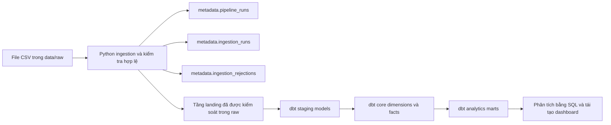

# Modern Retail ELT Warehouse

[](https://github.com/Daijestic/modern-retail-elt-warehouse/actions/workflows/ci.yml)

## Tổng quan dự án

Dự án Modern Retail ELT Warehouse là một kho dữ liệu ELT chạy trong môi trường local, lấy cảm hứng từ production, phù hợp để đưa vào portfolio cho vị trí Thực tập sinh Kỹ sư dữ liệu.
Dự án nhận các file CSV bán lẻ có dữ liệu mẫu xác định trước, kiểm tra hợp lệ bằng Python, nạp dữ liệu vào PostgreSQL ở tầng landing đã được kiểm soát, rồi dùng dbt để chuyển đổi sang các bảng sẵn sàng cho phân tích.

Repository này được giữ ở quy mô vừa đủ để sinh viên hoặc ứng viên có thể giải thích rõ trong phỏng vấn, nhưng vẫn thể hiện được các thành phần quan trọng của một pipeline Kỹ thuật dữ liệu:

- ingestion theo cấu hình
- nạp qua bảng staging và thay thế dữ liệu trong transaction
- lưu vết bản ghi bị loại
- theo dõi metadata của pipeline
- transform và kiểm thử bằng dbt
- quy trình local và CI có thể tái lập

## Bài toán nghiệp vụ

Các file CSV bán lẻ rất dễ chia sẻ, nhưng thường khó dùng trực tiếp cho phân tích vì thiếu kiểm soát về cấu trúc, chất lượng dữ liệu và lịch sử chạy.
Dự án này biến các file đó thành một luồng xử lý có thể lặp lại, giúp trả lời các câu hỏi về doanh thu, hiệu quả sản phẩm và giao hàng mà không phải làm sạch dữ liệu thủ công mỗi lần.

## Kiến trúc tổng thể



## Luồng dữ liệu

1. File CSV được tạo ra hoặc chép vào `data/raw/`.
2. Python kiểm tra cấu trúc file và các quy tắc chất lượng dữ liệu ở mức từng dòng.
3. Các dòng hợp lệ được nạp theo cách atomic vào các bảng `raw`.
4. Các bản ghi bị loại được ghi vào `metadata.ingestion_rejections`.
5. dbt xây dựng các tầng staging, core và marts phục vụ phân tích.
6. SQL hoặc công cụ BI đọc dữ liệu từ `analytics_marts`.

## Công nghệ sử dụng

- Python 3.11
- pandas
- SQLAlchemy
- psycopg2
- PostgreSQL 16.4 qua Docker Compose
- dbt Core với `dbt-postgres`
- pytest
- GitHub Actions

## Cấu trúc thư mục

```text
modern-retail-elt-warehouse/
|-- data/
|   |-- raw/
|-- db/
|   |-- init.sql
|-- dbt/
|   |-- macros/
|   |-- models/
|   |-- profiles.yml
|-- dashboards/
|-- docs/
|-- ingestion/
|-- scripts/
|   |-- project_cli.py
|-- tests/
|   |-- unit/
|   |-- integration/
|-- docker-compose.yml
|-- requirements.txt
|-- README.md
```

## Dữ liệu nguồn

Repository dùng bộ dữ liệu bán lẻ mẫu tổng hợp có tính xác định, giúp kết quả chạy có thể lặp lại trong local và CI.
Bạn có thể tạo lại dữ liệu bằng lệnh:

```bash
python scripts/project_cli.py prepare-sample-data
```

Các file nguồn hiện có:

- `customers.csv`
- `orders.csv`
- `order_items.csv`
- `products.csv`
- `payments.csv`
- `shipments.csv`

## Thiết kế ingestion

Tầng ingestion được điều khiển bằng cấu hình và kiểm tra từng bảng trước khi nạp.
Pipeline đọc toàn bộ giá trị CSV dưới dạng chuỗi, áp dụng các quy tắc kiểm tra hợp lệ có thể tái sử dụng, thêm các cột lineage/provenance, nạp các dòng hợp lệ vào một bảng staging tạm trong PostgreSQL, kiểm tra số dòng staging rồi thay thế dữ liệu của bảng đích trong transaction.

Các đặc điểm chính:

- không nuốt lỗi và không che giấu exception
- trả về exit code khác `0` nếu có bảng bắt buộc bị lỗi
- lưu vết bản ghi bị loại ở mức từng dòng
- nạp qua bảng staging và thay thế dữ liệu trong transaction
- tổng kết pipeline với trạng thái `SUCCESS`, `PARTIAL_SUCCESS` hoặc `FAILED`

Xem thêm tại [docs/ingestion_design.md](docs/ingestion_design.md).

## Ý nghĩa tầng raw/landing/staging/core/marts

### `raw`

`raw` trong repository này là một tầng landing đã được kiểm soát, không phải kho lưu trữ raw history bất biến.
Các dòng nguồn hợp lệ vẫn giữ hình dạng gần với CSV gốc, đồng thời được bổ sung cột provenance để phục vụ truy vết.

### `analytics_staging`

Đây là tầng staging của dbt, nơi thực hiện đổi tên cột, ép kiểu dữ liệu, chuẩn hóa text và chuẩn bị dữ liệu cho các model tin cậy hơn ở phía sau.

### `analytics_marts`

Schema này chứa cả tầng core và các data mart phục vụ phân tích.
Các bảng dimension, fact và mart tại đây là đầu ra chính để truy vấn nghiệp vụ hoặc dựng dashboard.

## Chính sách kiểm tra hợp lệ và bản ghi bị loại

Các lỗi ở mức file sẽ làm bảng đó thất bại và được ghi vào `metadata.ingestion_runs.error_type` cùng `metadata.ingestion_runs.error_message`:

- thiếu file
- file rỗng
- lỗi encoding
- thiếu cột bắt buộc
- có cột không mong đợi
- schema drift
- va chạm tên cột sau khi chuẩn hóa

Các lỗi ở mức từng dòng sẽ được cách ly thay vì làm hỏng cả lô, và từng dòng bị loại sẽ được ghi vào `metadata.ingestion_rejections`:

- khóa chính rỗng
- khóa chính trùng lặp
- giá trị số không hợp lệ
- timestamp không hợp lệ
- giá trị phân loại không được hỗ trợ
- giá trị giá tiền âm

Xem thêm tại [docs/data_quality.md](docs/data_quality.md).

## Metadata và khả năng quan sát

Metadata vận hành được lưu trong:

- `metadata.pipeline_runs`
- `metadata.ingestion_runs`
- `metadata.ingestion_rejections`

Nhờ đó bạn có thể trả lời các câu hỏi như:

- Lần chạy thành công gần nhất là khi nào?
- Bảng nào thất bại và vì sao?
- Có bao nhiêu bản ghi bị loại theo từng reason code?
- Mỗi nguồn dữ liệu thường mất bao lâu để nạp?

Xem thêm tại [docs/metadata.md](docs/metadata.md).

## Mô hình dữ liệu

Các tầng model chính của dbt:

- `raw`: tầng landing đã được kiểm soát trong PostgreSQL
- `analytics_staging`: đổi tên cột và ép kiểu một cách tường minh
- `analytics_marts`: bảng dimension, fact và data mart phục vụ phân tích

Các model core:

- `dim_customers`
- `dim_products`
- `fact_orders`
- `fact_order_items`

Các analytics marts:

- `mart_daily_revenue`
- `mart_product_performance`
- `mart_delivery_performance`

Tóm tắt grain:

- `dim_customers`: một dòng cho mỗi `customer_id`
- `dim_products`: một dòng cho mỗi `product_id`
- `fact_orders`: một dòng cho mỗi `order_id`
- `fact_order_items`: một dòng cho mỗi cặp `order_id` + `order_item_id`
- `mart_daily_revenue`: một dòng cho mỗi `order_date`
- `mart_product_performance`: một dòng cho mỗi `product_id`
- `mart_delivery_performance`: một dòng cho mỗi `order_id`

Xem thêm tại [docs/dimensional_model.md](docs/dimensional_model.md).

## Kiểm tra chất lượng dữ liệu

Dự án hiện có:

- kiểm thử Python cho logic kiểm tra hợp lệ và tính toán trạng thái pipeline
- kiểm thử tích hợp với PostgreSQL cho độ tin cậy của ingestion
- các test source, relationship và business rule trong dbt
- mô phỏng CI local thông qua Python task runner

Chạy toàn bộ test:

```bash
python -m pytest -q
```

## Cách chạy nhanh

### 1. Clone repository

```bash
git clone https://github.com/Daijestic/modern-retail-elt-warehouse.git
cd modern-retail-elt-warehouse
```

### 2. Tạo file môi trường local

```bash
cp .env.example .env
```

PowerShell:

```powershell
Copy-Item .env.example .env
```

### 3. Cài dependency

```bash
python -m pip install -r requirements.txt
```

## Demo một lệnh

```bash
python scripts/project_cli.py demo
```

Lệnh demo sẽ:

1. kiểm tra cấu hình Docker Compose
2. khởi động PostgreSQL
3. chờ database sẵn sàng
4. khởi tạo schema và bảng metadata
5. sinh dữ liệu CSV mẫu có tính xác định
6. chạy ingestion
7. chạy `dbt deps`
8. chạy `dbt build`
9. chạy các câu lệnh xác minh
10. in ra số dòng bảng và kết quả kiểm tra doanh thu ở mart

## Các lệnh thường dùng

```bash
python scripts/project_cli.py compose-config
python scripts/project_cli.py up
python scripts/project_cli.py wait-for-postgres
python scripts/project_cli.py init-db
python scripts/project_cli.py load
python scripts/project_cli.py dbt-deps
python scripts/project_cli.py dbt-parse
python scripts/project_cli.py dbt-build
python scripts/project_cli.py dbt-docs
python scripts/project_cli.py verify
python scripts/project_cli.py test
python scripts/project_cli.py check
python scripts/project_cli.py ci-local
python scripts/project_cli.py reset
python scripts/project_cli.py clean
```

Bạn cũng có thể dùng các target tương ứng trong `Makefile` để thao tác nhanh hơn.

## Kết quả mẫu

```text
INFO table_load_completed | status=SUCCESS source_file=orders.csv rows_read=60 rows_loaded=60 rows_rejected=0
INFO pipeline_run_completed | status=SUCCESS duration_seconds=0.921
analytics_marts.fact_orders: 60
analytics_marts.mart_daily_revenue gross_order_value: 102123000.00
```

## CI

GitHub Actions chạy trên các lần push vào `main` và các pull request.
Workflow hiện kiểm tra:

- cài dependency
- `docker compose config`
- compile check cho Python
- kiểm thử đơn vị
- kiểm thử tích hợp cho ingestion
- `dbt parse`
- kiểm thử tích hợp có dùng dbt
- sinh dbt docs
- các câu lệnh xác minh đầu ra

File workflow: [`.github/workflows/ci.yml`](.github/workflows/ci.yml)

## Quyết định thiết kế

- Giữ dự án trong môi trường local và theo hướng batch thay vì thêm orchestration hoặc hạ tầng cloud.
- Xem `raw` là tầng landing đã được kiểm soát thay vì mô tả sai là raw history bất biến.
- Dùng cơ chế nạp qua bảng staging và thay thế dữ liệu trong transaction vì nguồn dữ liệu hiện tại là snapshot CSV và không có CDC marker.
- Giữ SQL/dbt tường minh, dễ đọc thay vì trừu tượng hóa quá mức.

## Đánh đổi

- Chưa thêm incremental dbt model vì ngữ nghĩa nguồn hiện tại là full snapshot và chưa đủ an toàn cho logic xử lý gia tăng có xét delete.
- Repository không commit file dashboard binary; thay vào đó cung cấp marts, SQL, định nghĩa metric và hướng dẫn tái tạo dashboard.
- CI dùng PostgreSQL service container thay vì chạy Docker Compose lồng nhau để giữ thời gian chạy hợp lý và cấu hình đơn giản hơn.

Xem thêm tại [docs/tradeoffs.md](docs/tradeoffs.md).

## Giới hạn hiện tại

- chỉ dùng PostgreSQL đơn node trong môi trường local
- chỉ hỗ trợ nạp dữ liệu theo lô từ CSV
- dữ liệu là dữ liệu mẫu tổng hợp
- chưa có secrets manager cho production
- chưa có scheduler cho production
- chưa có xử lý phân tán
- khối lượng dữ liệu còn giới hạn
- `raw` là tầng landing đã được kiểm soát, không phải raw history bất biến

## Hướng phát triển tiếp theo

- thêm BI artifact có thể chia sẻ nếu có thể commit an toàn
- thêm logic xử lý gia tăng có xét delete nếu hệ nguồn cung cấp CDC hoặc cột cập nhật đủ tin cậy
- mở rộng các data mart cho thêm câu hỏi nghiệp vụ
- bổ sung data contract chi tiết hơn nếu schema nguồn thay đổi

## Tài liệu bổ sung

- [Kiến trúc](docs/architecture.md)
- [Hợp đồng dữ liệu](docs/data_contract.md)
- [Thiết kế ingestion](docs/ingestion_design.md)
- [Chất lượng dữ liệu](docs/data_quality.md)
- [Metadata](docs/metadata.md)
- [Mô hình dữ liệu](docs/dimensional_model.md)
- [Kiểm thử](docs/testing.md)
- [Đánh đổi](docs/tradeoffs.md)
- [Khắc phục sự cố](docs/troubleshooting.md)
- [Ghi chú tái tạo dashboard](dashboards/README.md)

## Ghi chú phát hành

- [CHANGELOG.md](CHANGELOG.md)
- [RELEASE_NOTES.md](RELEASE_NOTES.md)
