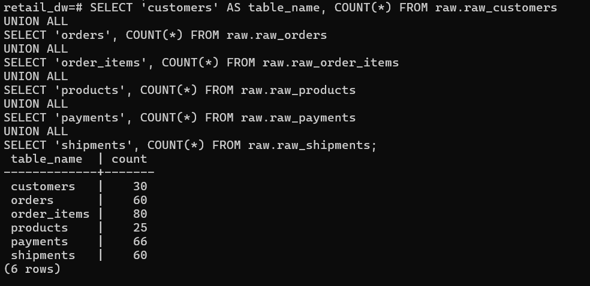
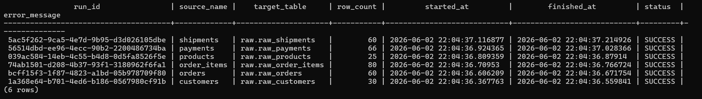
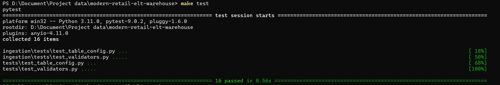
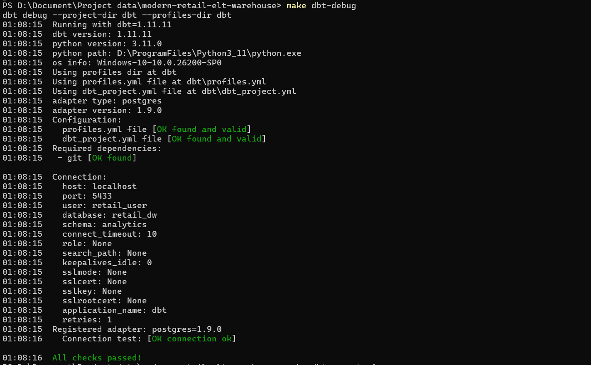
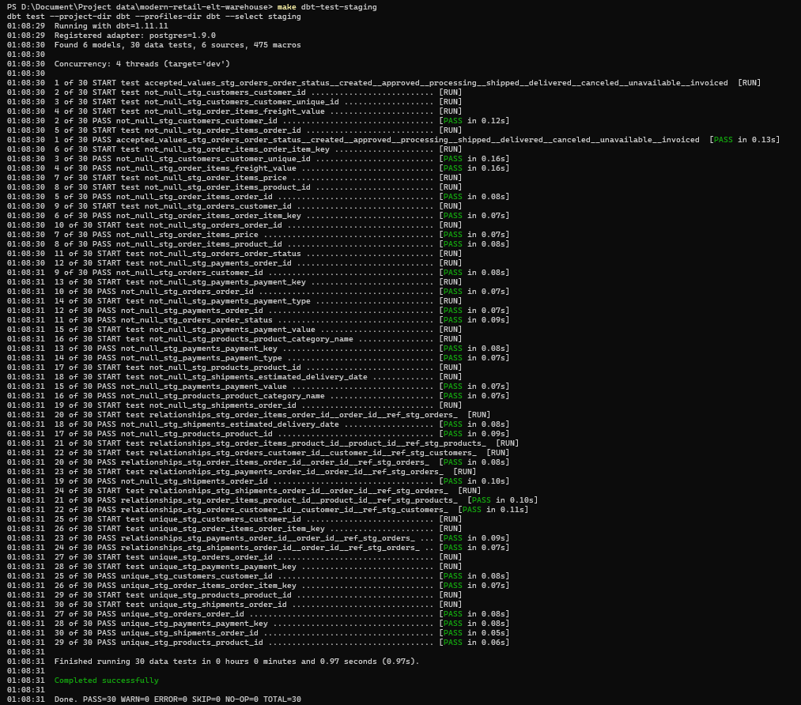
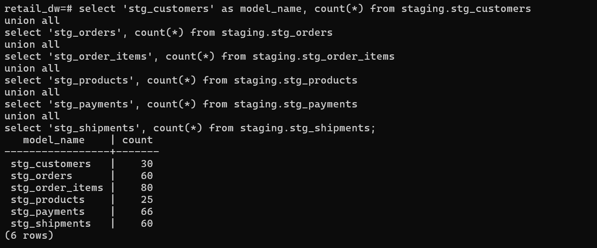

# Modern Retail ELT Warehouse

Production-like retail ELT warehouse built with Python, PostgreSQL, Docker, and dbt.

This project focuses on building a reliable ingestion and warehouse foundation for retail analytics, including validation, idempotent loading, ingestion tracking, and analytics-ready modeling.

---

# Business Problem

Retail teams need reliable analytics for revenue, customer retention, product performance, and delivery operations.

However, raw operational data is often inconsistent, duplicated, or missing required fields.

This project builds a production-like ELT warehouse that:

- ingests raw retail CSV data
- validates schema and required columns
- tracks ingestion runs
- loads data into PostgreSQL raw layer
- prepares the foundation for dbt transformations and analytics marts

---

# Current Project Status

### Completed
- Python CSV ingestion pipeline
- PostgreSQL raw schema
- Raw tables: customers, orders, order_items, products, payments, shipments
- Metadata tracking with metadata.ingestion_runs
- Required column validation
- Primary key validation
- Composite key support for order_items and payments
- Idempotent reload strategy with TRUNCATE + INSERT
- Structured logging
- Basic pytest coverage
- dbt project setup
- dbt raw sources
- dbt staging models
- dbt generic tests for staging models
- dbt source freshness configuration

### In Progress
- dbt intermediate models
- marts and star schema
- Metabase dashboard

### Planned
- SCD Type 2 snapshot
- incremental model
- Airflow orchestration
- GitHub Actions CI/CD
- AWS-ready architecture notes

---

# Tech Stack

| Category | Tools |
|---|---|
| Language | Python 3.11 |
| Database | PostgreSQL |
| Data Processing | pandas |
| ORM / DB Access | SQLAlchemy |
| Containerization | Docker Compose |
| Transformation | dbt Core |
| Testing | pytest |
| BI | Metabase |
| Orchestration | Airflow (planned) |
| CI/CD | GitHub Actions (planned) |

---

# Architecture

```text
CSV Retail Dataset
        ↓
Python ingestion pipeline
        ↓
Validation
- file existence check
- required column validation
- primary key null validation
- column name normalization
- duplicate handling
        ↓
PostgreSQL
- raw.raw_customers
- raw.raw_orders
- metadata.ingestion_runs
        ↓
SQL practice / dbt modeling layer (in progress)
        ↓
Analytics marts and dashboard (planned)
```

---

# Project Structure

```text
modern-retail-elt-warehouse/
│
├── ingestion/
│   ├── load_csv_to_postgres.py
│   ├── validators.py
│   ├── config.py
│   ├── db.py
│   ├── logger.py
│   └── table_config.py
│
├── tests/
│   ├── test_validators.py
│   ├── test_config.py
│   └── test_load_csv.py
│
├── sql_practice/
│
├── dbt/
│
├── docs/
│
├── docker-compose.yml
├── Makefile
├── requirements.txt
└── README.md
```

---

# Data Ingestion Design

The ingestion layer loads raw retail CSV files into PostgreSQL raw tables.

## Current Features

- Config-driven ingestion using `TABLE_CONFIG`
- Multi-table loading support
- Required column validation
- Primary key null validation
- Column name normalization
- Idempotent reload strategy (`TRUNCATE + INSERT`)
- Ingestion metadata tracking
- Structured logging
- Basic unit testing with pytest

---

# Raw Tables

Current raw tables:

```text
raw.raw_customers
raw.raw_orders
raw.raw_order_items
raw.raw_products
raw.raw_payments
raw.raw_shipments
```

Metadata tables:

```text
metadata.ingestion_runs
```

---

# Ingestion Flow

```text
validate file exists
        ↓
read CSV with pandas
        ↓
validate required columns
        ↓
normalize column names
        ↓
validate primary keys
        ↓
truncate target table
        ↓
batch insert into PostgreSQL
        ↓
record ingestion run metadata
        ↓
log success/failure
```

---

# Example Ingestion Metadata

```sql
SELECT *
FROM raw.ingestion_runs
ORDER BY started_at DESC;
```

Tracked fields include:

- run_id
- source_name
- target_table
- row_count
- status
- started_at
- finished_at
- error_message

---

# How to Run Locally

## 1. Start PostgreSQL

```bash
make up
```

---

## 2. Install Python Dependencies

```bash
make install
```

---

## 3. Prepare Raw CSV Files

Place source CSV files under:

```text
data/raw/
```

Required files for the current MVP:

```text
customers.csv
orders.csv
```

---

## 4. Run Ingestion

```bash
make load
```

---

## 5. Run Tests

```bash
make test
```

---

## 6. Open PostgreSQL Shell

```bash
make sql
```

---

## 7. Validate Loaded Data

Check row counts:

```sql
SELECT COUNT(*) AS customer_count
FROM raw.raw_customers;

SELECT COUNT(*) AS order_count
FROM raw.raw_orders;
```

Check ingestion history:

```sql
SELECT *
FROM metadata.ingestion_runs
ORDER BY started_at DESC;
```

---

## Expected Result

```text
✓ raw.raw_customers contains customer records
✓ raw.raw_orders contains order records
✓ metadata.ingestion_runs contains ingestion logs
✓ No ingestion errors are reported
```

---

# Testing

Current test coverage includes:

- Required column validation
- Table configuration validation
- CSV loading validation
- Primary key validation

Run tests:

```bash
pytest
```
---
# Screenshots

## Raw Layer Validation

### Raw Table Counts



### Ingestion Runs



## Test Results

### Python Unit Tests



## dbt Staging Layer

### dbt Debug


### dbt Run - Staging Models



### dbt Test - Staging Models



### Staging Table Counts



---

# Engineering Practices

This project currently implements:

- Config-driven ingestion
- Structured logging
- Validation before loading
- Idempotent reload strategy
- Metadata tracking
- Reproducible local environment
- Basic automated testing

Future improvements:

- Incremental loading
- Advanced deduplication
- dbt source freshness
- Data quality assertions
- Airflow orchestration
- CI/CD pipelines

---

# Roadmap

## Phase 1 - Ingestion Foundation ✅

- Python ingestion
- PostgreSQL raw layer
- Validation
- Logging
- Testing

## Phase 2 - Warehouse Modeling (Current)

- dbt staging models
- dbt intermediate models
- marts and star schema

## Phase 3 - Production Features

- Airflow DAGs
- GitHub Actions CI
- Data quality gates
- Monitoring
- AWS-ready architecture

---

# How to Run End-to-End

```bash
make up
make load
make test
make dbt-debug
make dbt-run-staging
make dbt-test-staging
make dbt-freshness
make dbt-docs
```

---

# Future Improvements

- dbt snapshots (SCD Type 2)
- Incremental models
- Source freshness monitoring
- Metabase dashboards
- Airflow orchestration
- GitHub Actions CI/CD
- AWS deployment notes

---

# Author

Built as part of a Data Engineering portfolio project focused on production-style ELT workflows and analytics engineering.