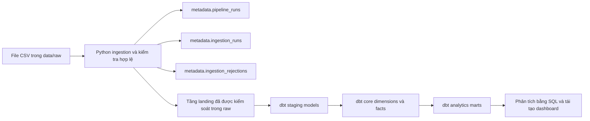

# Kiến trúc

## Tổng quan

Dự án này là một kho dữ liệu ELT chạy trong môi trường local, lấy cảm hứng từ production, dùng cho dữ liệu CSV bán lẻ có tính xác định.
Kiến trúc được giữ đơn giản có chủ đích:

- file CSV nguồn được sinh ra hoặc lưu cục bộ trong `data/raw/`
- Python phụ trách kiểm tra hợp lệ, lưu vết bản ghi bị loại, ghi metadata và nạp qua bảng staging rồi thay thế dữ liệu trong transaction
- PostgreSQL lưu tầng landing đã được kiểm soát trong `raw` và metadata vận hành trong `metadata`
- dbt xây dựng tầng staging, các model core theo mô hình hóa chiều và các analytics marts
- SQL hoặc công cụ BI có thể đọc các mart để phục vụ báo cáo

## Sơ đồ kiến trúc

## Các schema

- `raw`: các bảng landing snapshot đã được kiểm soát, kèm cột provenance từ nguồn
- `metadata`: metadata của pipeline và bản ghi audit cho các dòng bị loại
- `analytics_staging`: các view dbt ở tầng staging trong target không phải production
- `analytics_marts`: các bảng dimension, fact và analytics trong target không phải production

Với dbt target theo phong cách production, `custom schema` được dùng trực tiếp.
Với target không phải production, dbt thêm tiền tố là target schema để tránh va chạm giữa local và CI.

## Vì sao `raw` được xem là tầng landing

Schema `raw` trong dự án này không phải kho lưu trữ lịch sử bất biến.
Nó là một tầng landing snapshot đã được kiểm soát:

- mỗi lần chạy thay thế dữ liệu bảng đích trong transaction từ một bảng staging tạm
- các dòng nguồn hợp lệ vẫn giữ hình dạng gần với CSV gốc
- các bản ghi bị loại vẫn được lưu tại `metadata.ingestion_rejections`
- các bước transform như ép kiểu dữ liệu, chuẩn hóa text và business logic được thực hiện trong dbt

Thiết kế này giúp dự án trung thực với cách triển khai thực tế hiện có và dễ giải thích hơn trong portfolio cho vị trí Thực tập sinh Kỹ sư dữ liệu.
